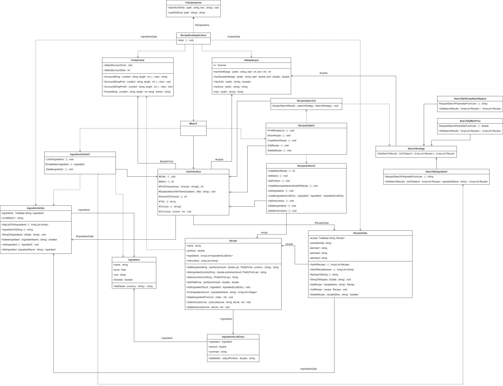

## The final implementation and updated design

The updated class diagram has twice the amount of classes compared to the first, but at the core of it is still the original design. When I considered letting RecipeBookApplication alone handle all input and output, I really underestimated the amount of code neccessary for this. However, I mentioned in intended.md that I was curious to see if I could find a Strategy pattern solution to the user interface, and pretty much the first thing I did after implementing the most basic functionality was to start experimenting with this.

I started out following the lecture on the Strategy pattern very closely, and created an interface called UserInterface for other UI classes to implement. I soon realized, though, that it made a lot more sense to let it be an abstract class with a number of subclasses. My understanding after googling it is that using an abstract class rather than an interface is acceptable practice with the Strategy pattern. Either way, it eventually became a really nice solution for the menu system. After creating UI classes for every part of the application that required user interaction, I improved it more and more and was able to really minimize code duplication.

I also added FileOperations, and the utility classes PrettyPrints and ValidateInput. In the final class diagram, all the added classes except for FileOperations ended up being grouped together in the middle, in between RecipeBookApplication and the other original classes.

One interesting problem I faced by the end of the implementation was how to handle deleting an ingredient from the IngedientsData, if the ingredient was listed in one or more recipes. I solved this by making a recipe search based on ingredient, notifying the user that the ingredient would also be deleted from the recipes, and asking if the user still wants to proceed.

The obvious solution to making the ingredient search was to use the SearchByContainsIngredient search strategy - however, I realized when drawing the class diagram that this created a dependency, reaching from one end of the diagram to the other. I could easily have copy-pasted the code from SearchByContainsIngredient into the IngredientsDataUI and done away with the depenceny, but then I would have really broke the DRY principle. I thought about it for a while, but ended up leaving the dependency.

Anyway, the assignment was a lot of work but also very fun - especially trying out the Strategy pattern, the UserInterface and SearchStrategy are my favorite parts of the implementation. Drawing the class diagrams was a lot easier now than in assignment 2, and I like how my final design turned out.
