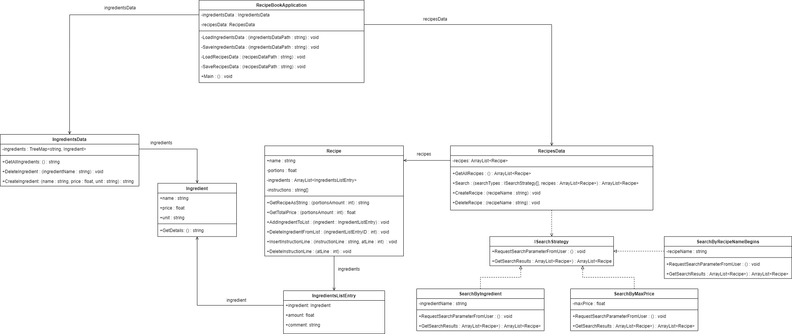

# Intended Design

Following the same procedure as in assignment 2, I began by drawing a basic class diagram in draw.io.

I tried to include as much of the passing grade-functionality as I could think of. However, I intentionally left out most of the functionality required for a higher grade - I study at a pace of 150%, and March has become a real bottleneck of final assignments in many of my courses. So, I decided that I will prioritize the design and implementation of the passing grade functionality, and come back and add the higher grade functionality if time allows it. Even though it isn't represented in the class diagram, I have thought how to also add recipe and ingredient labels as well as editing functionality, and I don't believe either of it will be very problematic.

I have implemented file I/O in Java before when I took Introduction to Java, so I'm not too worried about that either. I will probably see if there's some package for writing to and reading from JSON that I can make use of. 

My idea is that the **RecipeBookApplication** should handle all console interaction with the user, and trigger different behavior by calling methods on the other classes. Apart from the save and load methods, the RecipeBookApplication class currently only contains the Main method. However, rather than storing all the functionality within the Main method, I expect that much of the interaction functionality will be separated into a number of smaller methods called from Main in response to the user's actions. Since the purpose of these methods are mostly for code structure and readability, I will add them later on after implementing the RecipeBookApplication. If it makes sense to do so, I might think of a way to use the Strategy pattern for implementing the user interaction.